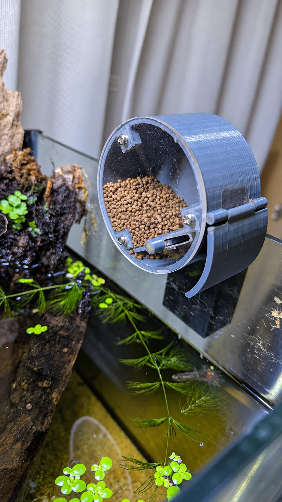
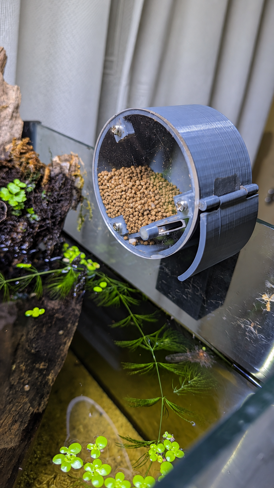
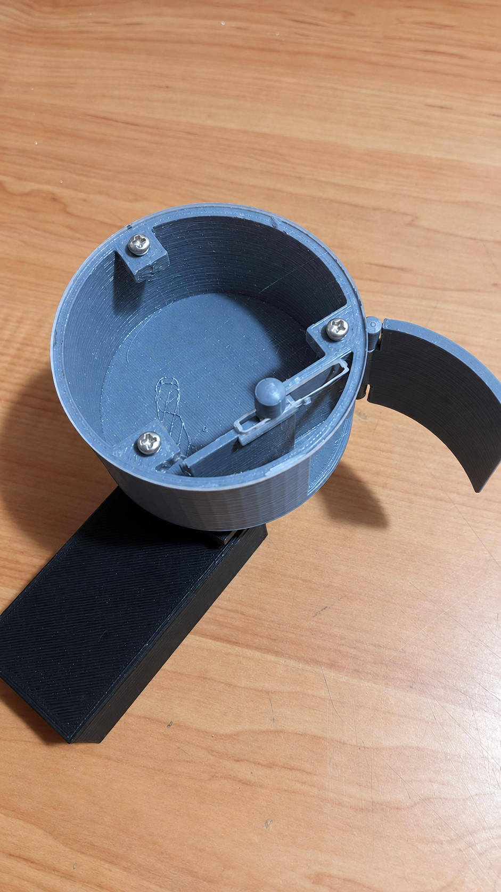
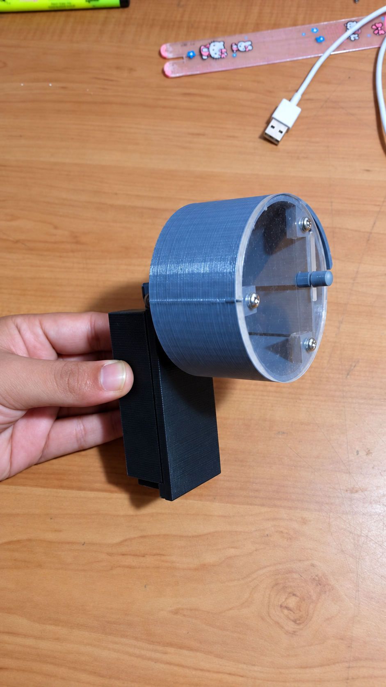
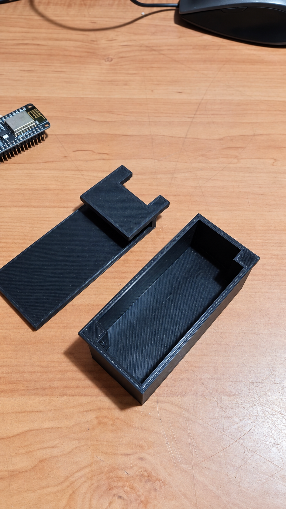

# 🐠 Automated Fish Tank Feeder

<p align="center">
  <strong>A Wi-Fi-connected aquarium feeder that provides scheduled and on-demand feeding through a custom web dashboard.</strong>
</p>

<p align="center">
  
</p>

---

## 📌 Overview

The **Automated Fish Tank Feeder** is a compact IoT device designed to deliver measured portions of food to an aquarium on a daily schedule. An **ESP-01 (ESP8266)** hosts a custom web dashboard for configuring two feeding times, viewing system status, and triggering an immediate manual feed.

The mechanical assembly uses a custom 3D-printed rotating drum, internal dispensing gate, transparent front cover, and clip-on aquarium mount. The result is a functional product prototype designed for convenient installation and everyday use.

## ✨ Key Features

- 📶 ESP-01 Wi-Fi connectivity
- 🌐 Custom local web dashboard
- 🕒 Two configurable feeding times per day
- ▶️ Manual on-demand feeding from a phone
- 📊 Current time, last-feed and device-status reporting
- 💾 Schedule storage that survives a restart
- ⚙️ Servo-operated dispensing mechanism
- 🖨️ Custom 3D-printed drum and aquarium mount
- 👀 Transparent cover for checking food level

## ⚙️ System Overview

| Component | Purpose |
| --- | --- |
| **ESP-01 / ESP8266** | Wi-Fi controller and local web server |
| **Servo motor** | Operates the dispensing mechanism |
| **Rotating drum and gate** | Releases a measured portion of fish food |
| **Transparent cover** | Allows visual inspection of food level |
| **Clip-on mount** | Secures the feeder to the aquarium |
| **EEPROM storage** | Retains two daily feeding schedules |
| **NTP time synchronization** | Maintains accurate scheduled operation |

## 🌐 Web Control

The embedded dashboard provides:

- Two editable daily feeding times
- A **Feed now** button for manual operation
- Current synchronized device time
- Last feeding time and source
- Feeding count since startup
- Wi-Fi signal status

The dashboard is intended for use on a trusted local network. It should not be exposed directly to the public internet.

### Custom browser dashboard

A separate responsive interface is included in [`web/`](web/):

- [`web/index.html`](web/index.html) — accessible dashboard structure
- [`web/styles.css`](web/styles.css) — responsive aquarium-inspired interface
- [`web/app.js`](web/app.js) — ESP-01 connection, live status, feeding and scheduling

To run it on a computer connected to the same Wi-Fi network as the feeder:

```bash
cd web
python3 -m http.server 8080
```

Open `http://localhost:8080`, enter the ESP-01 address shown in the Arduino Serial Monitor, and select **Connect**.

> Serve the dashboard over ordinary HTTP on the trusted local network. A public HTTPS host such as GitHub Pages cannot normally call an ESP-01's local HTTP address because browsers block mixed-content requests.

## 💻 Firmware

The Arduino-compatible ESP8266 firmware is available in [`firmware/automated_fish_feeder.ino`](firmware/automated_fish_feeder.ino). It includes both the simple on-device page and JSON endpoints used by the separate dashboard:

| Endpoint | Method | Purpose |
| --- | --- | --- |
| `/api/status` | `GET` | Device time, last feed, count, Wi-Fi signal and schedules |
| `/api/feed` | `POST` | Run one dispensing cycle |
| `/api/schedule` | `POST` | Save `time1` and `time2` in `HH:MM` format |

Before uploading:

1. Install ESP8266 board support in Arduino IDE.
2. Select the appropriate **Generic ESP8266 Module / ESP-01** settings.
3. Enter the local Wi-Fi credentials in the sketch.
4. Confirm the servo angles and dispensing duration for the physical mechanism.
5. Power the servo from a suitable regulated supply and connect its ground to the ESP-01 ground.

> **ESP-01 boot note:** GPIO2 must remain HIGH during startup. Verify that the servo signal circuit does not pull GPIO2 LOW while the ESP-01 boots.

## 📷 Project Gallery

<table>
  <tr>
    <td width="50%" align="center">
      <br>
      <sub><strong>Installed Feeder</strong><br>Working unit mounted above the aquarium.</sub>
    </td>
    <td width="50%" align="center">
      <br>
      <sub><strong>Food-Level View</strong><br>Transparent cover makes the remaining pellets visible.</sub>
    </td>
  </tr>
  <tr>
    <td width="50%" align="center">
      <br>
      <sub><strong>Dispensing Mechanism</strong><br>Rotating drum, gate and mounting assembly.</sub>
    </td>
    <td width="50%" align="center">
      <br>
      <sub><strong>Assembled Prototype</strong><br>Compact clip-on product configuration.</sub>
    </td>
  </tr>
  <tr>
    <td colspan="2" align="center">
      <br>
      <sub><strong>3D-Printed Components</strong><br>Custom housing and clip-on aquarium mount.</sub>
    </td>
  </tr>
</table>

## 🧠 Engineering Areas

`Embedded Systems` · `ESP8266` · `IoT` · `Web Control` · `Servo Control` · `CAD` · `3D Printing` · `Product Prototyping`

> **Design protection:** Editable CAD, STL files, dimensioned drawings, and manufacturing data are intentionally not published. The included firmware is provided as project documentation; the mechanical design remains All Rights Reserved.

---

## 👨‍💻 Developed by

**Theviru Lakwan**  
Mechatronics Engineer · PCB Designer · IoT Developer · Entrepreneur

[LinkedIn](https://linkedin.com/in/theviru-lakwan-7758a41b8) · [GitHub](https://github.com/MrTheviru)

---

### Intellectual Property

© 2026 Theviru Lakwan. All rights reserved.

This repository is provided for portfolio and demonstration purposes. No permission is granted to copy, modify, manufacture, distribute, sublicense, or commercially use the mechanical designs, documentation, images, or other original materials without prior written permission from the author.
